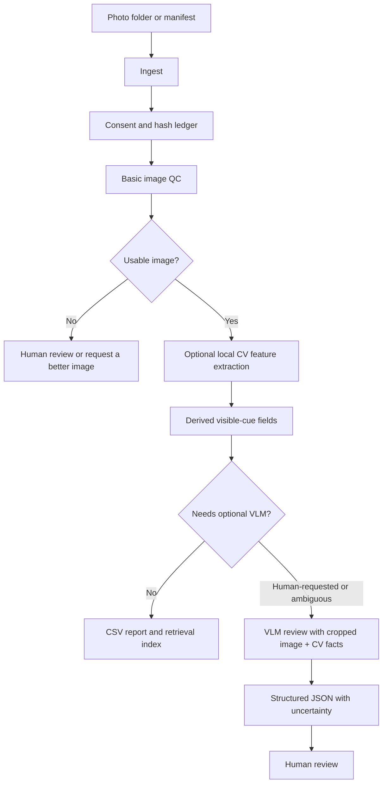

# Architecture

The MVP is a local pipeline for consented portrait-photo QA. It prioritizes deterministic checks and auditable records before any optional model review.

## Pipeline

## Layer 0: Governance And Ingest

Inputs:

- photo path
- `subject_id` if available
- consent source/version
- optional self-declared metadata

Stored immediately:

- SHA-256 hash
- file metadata
- consent receipt hash/source
- ingestion timestamp
- processing version

No image should reach remote APIs unless the consent record explicitly allows remote model processing.

## Layer 1: Cheap Deterministic Checks

Run on every photo:

- file integrity and dimensions
- blur/exposure/crop checks
- face count when a local detector is configured
- pose estimate when landmarks are configured
- eye/face visibility checks

Recommended libraries:

- **Pillow:** basic image dimensions and file validity; used by the MVP now.
- **OpenCV:** blur, exposure, color histograms, crop checks.
- **MediaPipe Face Landmarker:** 468 landmarks, blendshapes, transform matrix, geometry frontend.
- **InsightFace:** detection, alignment, and embeddings for lawful dedup/retrieval after license review.

Mark `needs_human_review` before expensive scoring when:

- no usable image data
- face is too small or cropped
- strong blur/compression
- extreme pose
- heavy shadow or overexposure
- local backends disagree beyond threshold

## Layer 2: Optional Feature Extraction

Run only after quality gates:

- embeddings for dedup/retrieval where lawful and licensed
- landmark ratios and symmetry
- face-region color statistics after segmentation
- apparent visual-cue models with uncertainty
- visual-brief embedding fit using CLIP/SigLIP-like models

All derived values should carry:

- confidence
- method
- input quality
- model version
- reasons
- review flags

## Layer 3: Optional VLM Review

Use VLM only for:

- human-requested review
- ambiguous images
- small top-K batches after local filtering
- structured notes for a specific visual brief

Do not use VLM for:

- bulk scoring every photo by default
- protected-trait inference
- actual health or personality claims
- direct celebrity likeness scoring

VLM input should include:

- downscaled face/portrait crop, not original full-resolution file unless needed
- CV facts: dimensions, pose, quality flags, face count, eye visibility
- allowed criterion names
- explicit prohibited inferences
- output JSON schema

## Token And Cost Controls

- Cache every VLM response by `photo_sha256 + prompt_version + model + crop_hash`.
- Send only compressed crops required for the review target.
- Batch only when references stay unambiguous.
- Do first-pass filtering with local CV features.
- Use cheaper multimodal models for routine QA, and stronger models only for calibration or disputed cases.
- Store abstentions and uncertainty so poor photos are not repeatedly re-scored.

## SaaS Path Later

When the local MVP is proven, split into:

- API service with auth, per-tenant isolation, rate limits, and spend caps.
- Worker for batch CV jobs and idempotent tasks.
- Object storage for images, Postgres for metadata, vector storage only if retrieval needs it.
- Review UI with sortable tables, evidence popovers, human overrides, and audit trail.
- Governance surface for consent, deletion, export, model registry, and abuse monitoring.

Do not add these until the local pipeline proves the column set and review gates.
